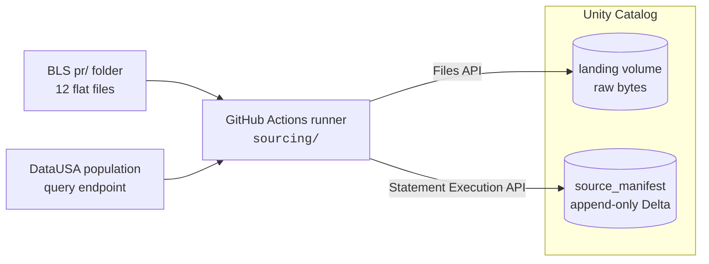
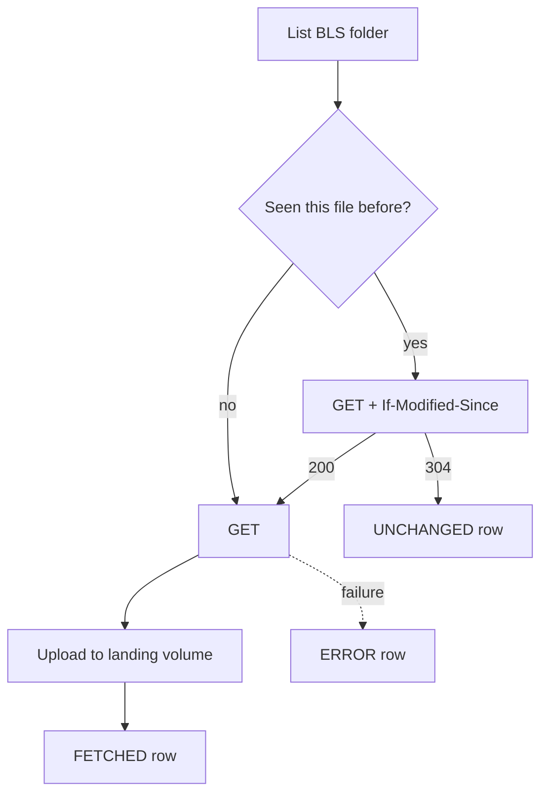

# Rearc Data Quest — Databricks Edition

Sourcing two public datasets onto Databricks and modelling them as a Spark
Declarative Pipeline, deployed as a Declarative Automation Bundle (DAB) on
Databricks Free Edition.

## Contents

- [Architecture](#architecture)
- [Why the fetcher runs outside Databricks](#why-the-fetcher-runs-outside-databricks)
- [Sources](#sources)
- [Environments](#environments)
- [Landing layout](#landing-layout)
- [The manifest](#the-manifest)
- [How a run decides what to fetch](#how-a-run-decides-what-to-fetch)
- [CI/CD](#cicd)
- [Repository layout](#repository-layout)

## Architecture



The fetcher is the only component that touches the public internet. Everything
it produces — raw bytes and the record of what it did — lands in Unity Catalog.

## Why the fetcher runs outside Databricks

Databricks Free Edition restricts outbound internet access from serverless
compute to a small allowlist of trusted domains. Neither source is on it, and
LinkedIn account verification does not widen it far enough — a notebook calling
either source fails at DNS resolution, not at the HTTP layer.

So the fetcher runs at the network edge, on a GitHub Actions runner, and pushes
into Unity Catalog through the Files API and the SQL Statement Execution API.
The ingestion agent sits wherever it can reach the network; the platform owns
the landing zone inward.

This is a Free Edition constraint, not a serverless one. On a paid workspace,
serverless has full outbound access unless a restricted network policy is
applied, and this same logic would run as a notebook task with no other change.

## Sources

| | BLS productivity | DataUSA population |
|---|---|---|
| Endpoint | [`download.bls.gov/pub/time.series/pr/`](https://download.bls.gov/pub/time.series/pr/) | `honolulu-api.datausa.io` tesseract query |
| Shape | 12 tab-delimited files in a folder | one JSON document per call |
| Update style | files rewritten in place under stable names | full result set returned every call |
| Access control | `403` without a contact-bearing `User-Agent` ([policy](https://www.bls.gov/bls/pss.htm)) | none |
| Change detection | conditional `GET` (`If-Modified-Since`) | `sha256` of the response body |

Filenames are never hardcoded. Every run re-parses the directory listing, so a
file BLS adds or removes is handled without a code change.

Neither source is append-only — both restate history — so landing is immutable
and every run that sees new bytes writes a new path.

## Environments

Three environments, one workspace. `env` and `catalog_prefix` are passed down by
the bundle; nothing in the repo hardcodes a catalog name. The fetcher reads
`catalog_prefix` straight out of `databricks.yml`, so it cannot drift from what
the bundle deploys.

| Catalog | Schemas | Holds |
|---|---|---|
| `rearc_ingest` | `dev`, `stage`, `prod` | `landing` volume + `source_manifest`, one independent set per environment |
| `rearc_dev` / `rearc_stage` / `rearc_prod` | processing schemas | targets for the declarative pipeline |

Each environment fetches its own copy rather than promoting one between them.
That buys cleaner isolation, at the cost of more traffic to the source and the
possibility that two environments hold snapshots taken at different moments.

## Landing layout

```
/Volumes/rearc_ingest/<env>/landing/
├── bls_pr/
│   ├── pr.data.1.AllData/
│   │   ├── pr.data.1.AllData__20260909T163000Z
│   │   └── pr.data.1.AllData__20261105T090200Z
│   ├── pr.series/
│   │   └── pr.series__20260909T163000Z
│   └── …one directory per file in the BLS folder
└── datausa_population/
    └── population/
        └── population.json__20260909T163000Z
```

`<source>/<dataset>/<filename>__<ingest_ts>`

Three decisions are encoded in that shape:

- **One directory per dataset.** The 12 BLS files have 12 different schemas, so
  each becomes its own table and needs its own stream. File-first gives every
  stream a clean, contiguous prefix instead of a mid-path wildcard.
- **The dataset name is the original filename, verbatim.** No normalised key, so
  an unknown new file lands correctly with no code change.
- **`ingest_ts` is a timestamp, not a date, and is computed once per run.**
  Auto Loader keys its checkpoint on file *path* and will not re-read a path it
  has already seen. Since both sources rewrite content under stable names, every
  release must land at a path that has never existed. A date would let two
  changes on the same day collide and silently lose the second.

## The manifest

`rearc_ingest.<env>.source_manifest` — Delta, `delta.appendOnly = true`.

One row per `(source, dataset, ingest_ts)` — per item, per run. A normal run
writes 13 rows: 12 BLS files plus the DataUSA document. Unchanged items get rows
too, because *"checked, nothing had changed"* is an audit statement worth being
able to make.

| Column | Type | |
|---|---|---|
| `source` | STRING | `bls_pr` / `datausa_population` |
| `dataset` | STRING | original filename, or `population` |
| `ingest_ts` | STRING | run stamp, matches the landed filename suffix |
| `status` | STRING | `FETCHED` / `UNCHANGED` / `ERROR` |
| `http_status` | INT | response code, null on a request-level failure |
| `content_sha256` | STRING | hash of the body |
| `last_modified` | STRING | raw header, replayed verbatim as `If-Modified-Since` |
| `bytes` | BIGINT | size landed |
| `source_url` | STRING | exact URL fetched |
| `landing_path` | STRING | where it went, null unless `FETCHED` |
| `run_id` | STRING | GitHub Actions run id, or `local` |
| `fetched_at` | TIMESTAMP | |
| `error_message` | STRING | populated only on `ERROR` |

Each run reads the most recent `FETCHED` row per dataset to build its
conditional headers and hash comparisons. A failed directory listing is recorded
under the sentinel dataset `_directory_listing` rather than failing silently.

## How a run decides what to fetch



Per item, always **download → upload → write the manifest row**, never the
reverse. In that order every failure degrades to the same bytes landing twice
under two timestamps, which a downstream upsert collapses harmlessly. Reversed,
one failed upload would mean that file is never ingested again and nothing
reports it.

Rows are written per item, not batched, so a crash mid-run leaves resumable
state. One item's failure never aborts the run: the rest still land, and the
process exits non-zero at the end if anything errored. A failed item retries on
the next run by itself, because its stored `last_modified` was never advanced.

There is no rollback and no compensation logic. Landing is immutable, so
recovery is a re-run — and an immediate re-run is a no-op that lands nothing and
writes 13 `UNCHANGED` rows.

Ingestion triggers nothing downstream. The two stay independent so either can be
re-run alone.

## CI/CD

Trunk-based: a single `main` plus short-lived feature branches. Deploy targets
are bundle targets, not git branches.

| Trigger | Workflow | Effect |
|---|---|---|
| PR to `main` | `pr.yml` | ruff, `bundle validate`, pytest, summary report |
| Merge to `main` | `deploy-dev.yml` | deploy to `dev` |
| Tag `v*-rc*` / dispatch | `deploy-stage.yml` | deploy to `stage` |
| Tag `v*` / dispatch | `deploy-prod.yml` | gated deploy to `prod` |
| Dispatch | `sourcing.yml` | fetch sources into the selected environment |

## Repository layout

```
databricks.yml            bundle definition: env + catalog_prefix, 3 targets
resources/                one file per job or pipeline
sourcing/                 the fetcher — runs on a GitHub runner, not on Databricks
  bls.py                  listing parser + conditional GET
  datausa.py              query endpoint + hash comparison
  landing.py              path construction + Files API upload
  manifest.py             Statement Execution API reads/writes
  config.py               env, catalog_prefix, warehouse resolution
src/setup/                catalogs, schemas, volumes, manifest DDL
src/utils/                importable helpers, unit tested
tests/                    bundle guardrails + sourcing unit tests (no Spark)
.github/workflows/        pr, deploy-dev, deploy-stage, deploy-prod, sourcing
```

The fetcher lives outside `src/` on purpose: nothing in `sourcing/` ever runs on
Databricks compute, and nothing it imports is available there.
