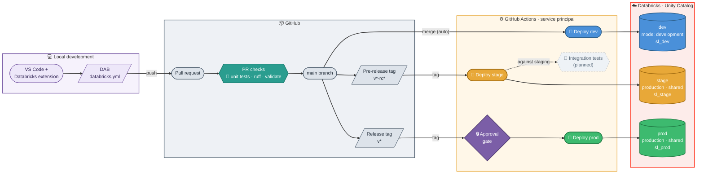
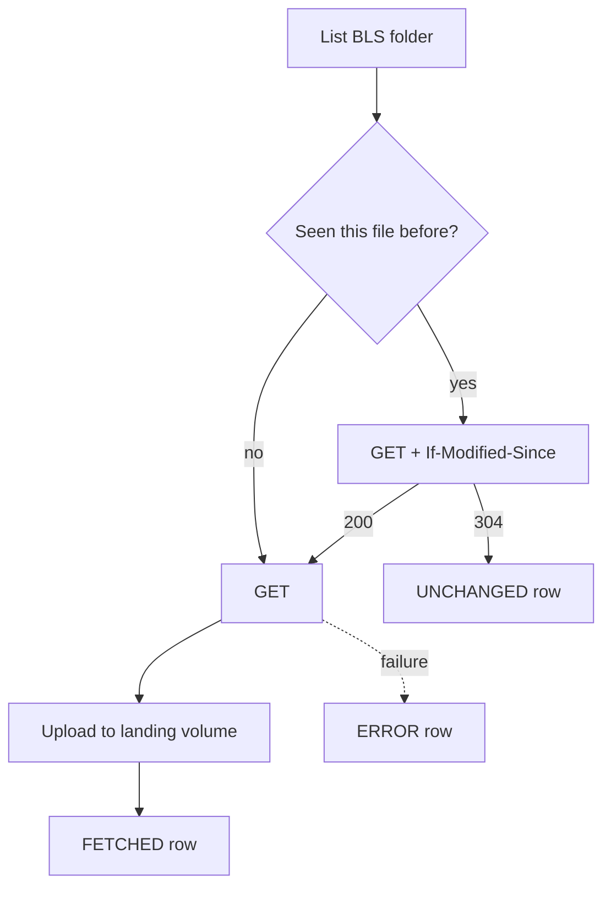

```mermaid
flowchart LR
  subgraph GH["`**GitHub**`"]
    direction TB
    BLS["`**BLS**
    pr/ folder, 12 flat files`"]:::source
    API["`**DataUSA**
    population query endpoint`"]:::source
    GHA["`**Job 1: source and land**
    Actions runner, sourcing/`"]:::job
    BLS -->|"conditional GET"| GHA
    API -->|"sha256 of the body"| GHA
  end

  subgraph DBX["`**Databricks**`"]
    direction LR
    subgraph LAND["`**Landing**`"]
      direction TB
      VOL[("`**landing volume**
      raw bytes`")]:::storage
      MAN[("`**source_manifest**
      append-only Delta`")]:::storage
    end
    subgraph BRONZE["`**Bronze** · DP 2`"]
      BZ["`**11 tables**
      raw as landed
      Auto Loader + audit columns`"]:::bronze
    end
    subgraph J3["`**DP 3: silver and gold**`"]
      direction LR
      subgraph SILVER["`**Silver**`"]
        SV["`**10 tables**
        typed, deduplicated, CDC`"]:::silver
      end
      subgraph GOLD["`**Gold**`"]
        GD["`**3 materialized views**
        joins and aggregates`"]:::gold
      end
      SV --> GD
    end
    NOTE["`Unity Catalog: one independent copy of everything above
    per target (dev / stage / prod)`"]:::note
  end

  GHA -->|"Files API"| VOL
  GHA -->|"Statement Execution API"| MAN
  VOL -.->|"checks the volume<br/>on its own schedule"| BZ
  BZ -.->|"checks bronze tables<br/>on its own schedule"| SV

  classDef source fill:#6b7280,stroke:#374151,stroke-width:2px,color:#ffffff
  classDef job fill:#2088ff,stroke:#0b5fcc,stroke-width:2px,color:#ffffff
  classDef bronze fill:#cd7f32,stroke:#8b4513,stroke-width:2px,color:#1a1a1a
  classDef silver fill:#c0c0c0,stroke:#5b5b5b,stroke-width:2px,color:#1a1a1a
  classDef gold fill:#ffd700,stroke:#b8860b,stroke-width:2px,color:#1a1a1a
  classDef storage fill:#38bdf8,stroke:#0284c7,stroke-width:2px,color:#ffffff
  classDef note fill:#fdeee9,stroke:#fdeee9,stroke-width:0px,color:#8f1d0c

  style GH fill:#f2f4f7,stroke:#57606a,stroke-width:3px,color:#1f2328
  style DBX fill:#fdeee9,stroke:#ff3621,stroke-width:3px,color:#8f1d0c
  style LAND fill:#ffffff,stroke:#0284c7,stroke-width:2px,color:#075985
  style BRONZE fill:#ffffff,stroke:#cd7f32,stroke-width:2px,color:#7c4a1e
  style J3 fill:#fbfbfb,stroke:#9aa0a6,stroke-width:2px,color:#3c4043
  style SILVER fill:#ffffff,stroke:#8a8a8a,stroke-width:2px,color:#4a4a4a
  style GOLD fill:#ffffff,stroke:#b8860b,stroke-width:2px,color:#8a6508

  linkStyle default stroke:#4b5563,stroke-width:3px
```

<div align="center">

# Rearc Data Quest on Databricks

Sourcing two public datasets onto Databricks, modelling them through a
bronze, silver, and gold medallion pipeline, and analyzing BLS Major Sector Productivity and Costs through an AI/BI dashboard, all deployed as a Declarative
Automation Bundle (DAB) on Databricks Free Edition.


[](https://www.databricks.com)
[](https://www.python.org)
[](https://spark.apache.org/docs/latest/api/python/)
[](https://delta.io)
[](https://claude.com/claude-code)

</div>

## Built with Claude Code

This project is built in close collaboration with Claude Cowork and Claude
Code.

Claude Code sessions run on a set of custom plugins and slash commands,
published in a personal marketplace repo,
[schmucas/dotclaude](https://github.com/schmucas/dotclaude), alongside
Databricks' own officially maintained `databricks` plugin (DABs, Lakeflow
Jobs, Spark Declarative Pipelines, Unity Catalog, and more).

This repo also wires up Databricks' managed MCP server so Claude Code can
query the workspace directly, configured via a project-level `.mcp.json`
rather than Claude's own UI, since the workspace connection is tied to this
project.

[PROCESS.md](PROCESS.md) covers how that worked in practice: the stage-by-stage
workflow, how AI output was validated and where it had to be corrected, where it
was not good enough and the work was taken over by hand, how databricks DABs helped speed up the manual edits on the UI by updating the code with the latest hand edited UI version, and what worked well and what I would do differently next time.

## Contents

- [The idea](#the-idea)
- [What is in here](#what-is-in-here)
- [Repo map](#repo-map)
- [Design decisions and gotchas](#design-decisions-and-gotchas)
- [Trade-offs](#trade-offs)
- [Reference](#reference)

## The idea

Databricks Free Edition restricts outbound internet access from serverless
compute to a small allowlist of trusted domains. Neither BLS nor DataUSA is on
it, so a notebook calling either fails at DNS resolution, not the HTTP layer.
That constraint shapes the whole design: ingestion has to run somewhere that
can reach the network, and everything from there in has to run on Databricks,
deployed as code.

The answer: a fetcher that lives outside Databricks entirely (a GitHub Actions
runner, `sourcing/`), pushing raw bytes and a record of what it did into Unity
Catalog. Two Lakeflow Declarative Pipelines, each deployed via the same
Databricks Asset Bundle, turn those landed files into a bronze, silver, and
gold medallion. The three stages, source and land, bronze, and silver and
gold, run as three separately triggered units: a GitHub Actions workflow, and
two Databricks Jobs that each refresh a declarative pipeline. They are
deliberately decoupled: sourcing triggers nothing downstream, bronze checks
the landing volume for new files on its own schedule rather than being told
about them, and silver and gold checks bronze's tables on its own schedule
rather than being triggered when a bronze run finishes. That decoupling
means silver and gold's schedule can be tuned to what downstream consumers
actually need, faster or slower than ingestion, without touching ingestion
at all.

<div align="center">
  <picture>
    <source media="(prefers-color-scheme: dark)" srcset="https://cdn.simpleicons.org/github/c9d1d9">
    
  </picture>
  &nbsp;&nbsp;&nbsp;&nbsp;<b>&rarr;</b>&nbsp;&nbsp;&nbsp;&nbsp;
  
</div>



On a paid workspace the network constraint would not exist: serverless has
full outbound access unless a restricted network policy is applied, and the
fetcher would run as a notebook task with no other change. The medallion
split and the decoupled scheduling would stay exactly the same.

## What is in here

**Sources.**

| | BLS productivity | DataUSA population |
|---|---|---|
| Endpoint | [`download.bls.gov/pub/time.series/pr/`](https://download.bls.gov/pub/time.series/pr/) | `honolulu-api.datausa.io` tesseract query |
| Shape | 12 tab-delimited files in a folder | one JSON document per call |
| Update style | files rewritten in place under stable names | full result set returned every call |
| Access control | `403` without a contact-bearing `User-Agent` ([policy](https://www.bls.gov/bls/pss.htm)) | none |
| Change detection | conditional `GET` (`If-Modified-Since`) | `sha256` of the response body |

Filenames are never hardcoded. Every run re-parses the directory listing, so a
file BLS adds or removes is handled without a code change.

**The landing volume**, one independent copy per environment:
`/Volumes/rearc_ingest/<env>/landing/<source>/<dataset>/<filename>__<ingest_ts>`.

```
/Volumes/rearc_ingest/<env>/landing/
├── bls_pr/
│   ├── pr.data.1.AllData/
│   │   ├── pr.data.1.AllData__20260909T163000Z
│   │   └── pr.data.1.AllData__20261105T090200Z
│   ├── pr.series/
│   │   └── pr.series__20260909T163000Z
│   └── …one directory per file in the BLS folder
└── datausa_population/
    └── population/
        └── population.json__20260909T163000Z
```

**The manifest**, `rearc_ingest.<env>.source_manifest`: append-only Delta, one
row per `(source, dataset, ingest_ts)`, written per item on every run,
including unchanged ones.

| Column | Type | |
|---|---|---|
| `source` | STRING | `bls_pr` / `datausa_population` |
| `dataset` | STRING | original filename, or `population` |
| `ingest_ts` | STRING | run stamp, matches the landed filename suffix |
| `status` | STRING | `FETCHED` / `UNCHANGED` / `ERROR` |
| `http_status` | INT | response code, null on a request-level failure |
| `content_sha256` | STRING | hash of the body |
| `last_modified` | STRING | raw header, replayed verbatim as `If-Modified-Since` |
| `bytes` | BIGINT | size landed |
| `source_url` | STRING | exact URL fetched |
| `landing_path` | STRING | where it went, null unless `FETCHED` |
| `run_id` | STRING | GitHub Actions run id, or `local` |
| `fetched_at` | TIMESTAMP | |
| `error_message` | STRING | populated only on `ERROR` |

Each run reads the most recent `FETCHED` row per dataset to build its
conditional headers and hash comparisons. A failed directory listing is
recorded under the sentinel dataset `_directory_listing` rather than failing
silently.

**Environments.** Three environments on one workspace, separated at the catalog
level in Unity Catalog. They are bundle targets, not git branches: the same
commit deploys to any of them, and only `env` and `catalog_prefix` change.

| Catalog | Schemas | Holds |
|---|---|---|
| `rearc_ingest` | `dev`, `stage`, `prod` | `landing` volume + `source_manifest`, one independent set per environment |
| `rearc_dev` / `rearc_stage` / `rearc_prod` | `bronze`, `silver`, `gold` | targets for the declarative pipelines |



**CI/CD.** Trunk-based: a single `main` plus short-lived feature branches.
Promotion happens by tag, never by branch, and nothing reaches an environment
without passing the PR checks first.

| Trigger | Workflow | Effect |
|---|---|---|
| PR to `main` | `pr.yml` | ruff, `bundle validate --target dev`, pytest, and a rendered report on the run's Summary tab |
| Merge to `main` | `deploy-dev.yml` | auto-deploy to `dev` |
| Tag `v*-rc*` | `deploy-stage.yml` | deploy to `stage` |
| Tag `v*` | `deploy-prod.yml` | deploy to `prod`, behind an approval gate |
| Manual dispatch | `sourcing.yml` | fetch sources into the selected environment |

Both tag workflows listen on `v*`, so `deploy-prod.yml` carries a job condition
excluding anything containing `-rc`. One tag pattern therefore cannot fire both.

`dev` runs `mode: development`: every deploy is an isolated copy with prefixed
resource names and paused schedules, deployed automatically on each merge to
`main`, and equally deployable from a developer's own account locally. `stage`
and `prod` run `mode: production` with `stage_` / `prod_` name prefixes and
fixed shared root paths under `/Workspace/Shared/<target>/`, and are only ever
deployed by CI, on a tag.

Two Free Edition realities shape the mechanics:

- **PAT, not a service principal.** Free Edition has no account console, so
  OAuth M2M is unavailable and deploys authenticate with a personal access token
  held as a repository secret. On a paid workspace this would be a service
  principal, and nothing else about the pipeline would change.
- **The approval gate needs a public repo.** GitHub Free enforces required
  reviewers on Environments only in public repositories, so the `production`
  gate here is real. In a private repo the environment still exists and the
  deploy proceeds unattended, which is worth knowing before relying on it.

**Schedules ship paused.** Job schedules are declared on the target rather than
in the resource file, so `dev` stays manual, and every `stage` / `prod` schedule
deploys with `pause_status: PAUSED`. Unpausing is a deliberate per-environment
act, not something a deploy does on your behalf.

**Bronze layer**, `resources/dp_bronze_ingestion.yml` + `src/bronze/`: one
Delta table per BLS file, one for DataUSA population, all raw. No filtering,
casting, or validation: every column lands as `STRING`, and every table
carries `_ingested_at` and `_source_file` for provenance. Trimming and typing
are silver's job.

It runs as its own pipeline and its own job (`declarative_bronze_ingestion_job`),
separate from silver and gold. Nothing wires the two together: bronze checks
the landing volume on every run and does nothing when there is nothing new,
the same way sourcing triggers nothing downstream.

**Silver layer**, `resources/dp_silver_gold.yml` (shared with gold) +
`src/silver/`: one table per bronze source, typed and deduplicated. Bronze
lands everything as `STRING`, so silver casts deliberately: `year`, `value`,
`begin_year`, `end_year`, `base_year`, `display_level`, and `sort_sequence`
to numeric types, `selectable` to `BOOLEAN`. Identifier codes (`series_id`,
`measure_code`, `sector_code`, and the rest) stay `STRING`: they are not
quantities, and `measure_code` values like `"01"` would lose their leading
zero under a numeric cast. Deduplication uses SCD Type 1 change-data-capture
(`dp.create_auto_cdc_flow`, sequenced by `_ingested_at`), since both sources
restate history and bronze stacks every snapshot ever landed. `pr_data_0_current`
is left unmodelled: it is a strict subset of `pr_data_1_alldata`, so modelling
it too would only duplicate rows.

**Gold layer**, same pipeline + `src/gold/`: three fully qualified
materialized views. `population_stats`: mean and standard deviation of US
population, 2013 to 2018, using the population formula rather than the
sample formula, since the question asks about that exact six-year window,
not a sample drawn from a larger one. `agg_value_per_year`: summed Q01-Q04
value per series per year, with `is_best_year` flagging the highest-summed
year per series, and a human-readable label built from `pr_series`'s
dimension codes. `value_per_quarter`: the same computation at quarter grain,
unsummed, with `best_year_per_quarter` flagging the highest-value year
separately within each series-and-quarter slot. Both per-series views
left-join population by year rather than keeping a `PRS30006032`-specific
view: population applies identically to any series in a given year, so
generalizing the join retired the one narrower, single-series view. Each
analysis is implemented twice, once in the PySpark DataFrame API and once in
Spark SQL, with PySpark as the primary that feeds the table and SQL kept
alongside as a documented, runnable alternative.

Silver and gold run as their own pipeline and their own job
(`declarative_silver_gold_job`), decoupled from bronze the same way bronze is
decoupled from sourcing.

**Dashboard**, `resources/dashboard.yml` + `dashboards/rearc_gold.lvdash.json`:
one AI/BI (Lakeview) dashboard over the gold layer, deployed as a bundle
resource rather than built by hand in the workspace. It answers the quest's
three analytical questions directly, for a reviewer who may not have
workspace access: population's mean and standard deviation, the best year
(and best quarter) for every series with a human-readable label instead of a
bare series code, and the history of a chosen series tracked against
population. `dataset_catalog` and `dataset_schema` on the resource, not a
literal catalog name inside the dashboard JSON, let every dataset query a
bare table name and stay portable across dev, stage, and prod.

**Maintenance**, `resources/maintenance.yml` + `src/maintenance/`: a job that
runs `OPTIMIZE` across every table in `bronze`, `silver` and `gold`, with an
optional `VACUUM` behind a `run_vacuum` parameter that defaults to off. It comes
from the project template and nothing here requires it: predictive optimization
already handles this on managed Unity Catalog tables. It is kept because every
bronze table uses `cluster_by_auto=True`, so having a one-command way to force a
rewrite makes it easy to see what a clustering change actually does to file
layout and query performance. Not scheduled on any target.

## Repo map

```
databricks.yml            bundle definition: env + catalog_prefix, 3 targets
resources/                one file per job, pipeline, or dashboard
sourcing/                 the fetcher, runs on a GitHub runner, not on Databricks
  bls.py                  listing parser + conditional GET
  datausa.py              query endpoint + hash comparison
  landing.py              path construction + Files API upload
  manifest.py             Statement Execution API reads/writes
  config.py               env, catalog_prefix, warehouse resolution
src/bronze/               raw landing tables, one per BLS file + DataUSA
src/silver/               typed, deduplicated tables, one per bronze source
src/gold/                 gold materialized views, PySpark + SQL implementations
dashboards/               Lakeview dashboard JSON, deployed via resources/dashboard.yml
src/setup/                catalogs, schemas, volumes, manifest DDL
src/maintenance/          OPTIMIZE across all schemas, optional VACUUM
src/utils/                importable helpers, unit tested
tests/                    bundle guardrails + sourcing unit tests (no Spark)
.github/workflows/        pr, deploy-dev, deploy-stage, deploy-prod, sourcing
```

The fetcher lives outside `src/` on purpose: nothing in `sourcing/` ever runs
on Databricks compute, and nothing it imports is available there.

## Design decisions and gotchas

### Why it is built this way

| Decision | Why |
|---|---|
| Landing is immutable; every changed fetch writes a new path | Neither source is append-only, both restate history |
| One landing directory per dataset, not per source | The 12 BLS files have 12 different schemas, so each needs its own table, its own stream, and a clean contiguous prefix |
| The dataset name is the original filename, verbatim | No normalised key, so a file BLS adds lands correctly with no code change |
| `ingest_ts` is a timestamp, not a date, computed once per run | Auto Loader keys its checkpoint on file *path*; a date would let two same-day changes collide and silently lose the second |
| Each environment fetches its own copy | Cleaner isolation, at the cost of 3x the source traffic and possible snapshot skew between environments |
| Bronze is a separate pipeline and job from silver and gold | Either can be redeployed, re-run or rescheduled alone. The hour offset in stage and prod is a scheduling courtesy, not a dependency |
| Bronze lands everything as `STRING` (`cloudFiles.inferColumnTypes` off) | Types get applied deliberately in silver rather than inferred. Every cast was checked against live data: `selectable` is `T`/`F`, `base_year` uses `-` as BLS's N/A sentinel |
| DataUSA lands as one VARIANT column | `singleVariantColumn` preserves the response as-is. Nothing is parsed into fields, so there is no `_rescued_data` column to populate |
| Every bronze table sets `cluster_by_auto=True` | Databricks picks clustering keys from observed query patterns instead of a fixed declaration |
| Silver dedups with Auto CDC, not a window function | `dp.create_auto_cdc_flow`, SCD Type 1, sequenced by `_ingested_at` is what actually collapses bronze's stacked snapshots after a restatement |
| Gold implements every analysis twice | PySpark is the primary that feeds the table; the Spark SQL version sits beside it as real runnable code, per the quest's ask |
| `value_per_quarter` stays separate from `agg_value_per_year` | Different grains. Merging them risks double-counting in an accidental `SUM`, or forces a discriminator column every downstream query must filter on |

### Failure ordering

Per item, always download, then upload, then write the manifest row. Never the
reverse.



In that order every failure degrades to the same bytes landing twice under two
timestamps, which a downstream upsert collapses harmlessly. Reversed, one failed
upload means that file is never ingested again and nothing reports it.

Rows are written per item rather than batched, so a crash mid-run leaves
resumable state, and one item's failure never aborts the run: the rest still
land and the process exits non-zero at the end. A failed item retries next run
on its own, because its stored `last_modified` was never advanced. There is no
rollback and no compensation logic, because landing is immutable: recovery is a
re-run, and an immediate re-run is a no-op that lands nothing and writes 13
`UNCHANGED` rows.

### What the data does that you would not expect

| Caveat | Detail |
|---|---|
| **`Q05` is BLS's annual average, not a fifth quarter** | `PRS30006011` in 1995: quarters 2.6, 2.1, 0.9, 0.1 and `Q05` = 1.4, their mean. Gold's sum-of-quarters excludes it; including it inflates every total by ~25% and can flip which year wins |
| **`value` has no single unit** | `duration_code` decides index (2017 = 100) vs quarter-over-quarter vs year-over-year percent change; `measure_code` decides which of 23 quantities. Summed percent changes are not annual growth, and ranking across series compares incomparable units. Implemented exactly as the quest defines it; labels carry the duration text |
| **Population has no 2020** | The Census published no standard ACS 1-year estimate. Gold left-joins by year: BLS history starts in 1987, so an inner join would drop most of the answer |
| **`pr.data.0.Current` is a subset of `pr.data.1.AllData`** | 1995 onward against 1987 onward, identical schema. Landed and bronzed because it is what the source publishes, deliberately unmodelled in silver |
| **`pr.txt` is stale on the base year** | Prose says 2005 = 100, `pr.duration` says 2017 = 100. `base_year` on `pr.series` is authoritative per series |

### Things that bit us

| Gotcha | What to know |
|---|---|
| Delta rejects spaces in column names outright | BLS pads `series_id` with trailing spaces inside the header line itself (17-char fixed width). Table creation fails unless `delta.columnMapping.mode = 'name'` is set. This was a real deploy failure, not a hypothetical |
| BLS's padding is not always trailing | `series_id` pads right, `value` pads left, since BLS right-justifies numerics. Silver strips column names generically rather than assuming a direction |
| BLS returns `403` without a contact-bearing `User-Agent` | Including on the directory-listing request itself |
| Free Edition serverless cannot reach either source | Fails at DNS resolution rather than the HTTP layer, so the error never names the real cause |
| Auto Loader will not re-read a path it has processed | Both sources rewrite content under stable filenames, so the landing path needs a fresh timestamp every run |
| A column type change on an existing CDC target needs a full refresh | Delta will not merge `StringType` into `IntegerType` or `BooleanType` in place; silver's casts failed with `CANNOT_UPDATE_TABLE_SCHEMA` until refreshed. Landing is immutable, so the rebuild is deterministic |
| `variant_get` needs a bracket-quoted path for keys with spaces | DataUSA uses the literal key `"Nation ID"`, so `$["Nation ID"]`, not `$.Nation ID` |
| Dashboard resources take `dataset_catalog` / `dataset_schema` | Not `default_catalog` / `default_schema` — those do not exist in the schema (checked with `databricks bundle schema`) and silently no-op, leaving every dataset unable to resolve its catalog |
| Editing a bundle-deployed dashboard in the UI embeds a literal catalog name | Breaks portability across targets, and makes the next `bundle deploy` refuse to run (`dashboard has been modified remotely`) until the local file is re-synced or the deploy forced |
| Publishing a Lakeview dashboard does not remove edit access | It creates a separate read-styled snapshot at a `/published` URL; the editable draft is a different view |

## Trade-offs

What would change for a real client:

| Area | Here | At a client |
|---|---|---|
| **Schema drift** | `addNewColumns` plus a rescued-data column; a non-null rescue is a warn-level expectation | Alert on rescued data rather than warn, and gate promotion on it |
| **Data volume** | ~5 MB total; gold fully refreshes | Incremental gold and clustering tuned to real access patterns |
| **Cost** | Per-environment fetching means 3x the traffic to BLS, and snapshots that can differ between environments | Fetch once and promote between environments: cheaper and reproducible |
| **Access control** | Owner-only | Unity Catalog grants, with a read-only analyst role on gold and nothing below it |
| **Monitoring** | A freshness expectation off the manifest | Alerting on expectation failures and fetch errors, plus a data-quality dashboard |
| **Orchestration** | Sourcing is manual-dispatch only | Scheduled, with retries and backoff on transient source failures |

**The GitHub Actions fetcher is a workaround, not a production pattern.** It
gets around the Free Edition egress restriction, but a CI runner does not belong
on the critical path of a production ingestion. It is sufficient here, and the
source cadence makes it comfortably so: BLS publishes this data quarterly.

**Known gaps, stated rather than hidden.** The fetcher has no retry or backoff,
so one flaky connection to BLS becomes a failed run. There is no post-upload
size verification against `content_length`. The sourcing workflow has no cron.

**Accepted coupling.** Bronze lives in a declarative pipeline, so only that
pipeline can write those tables, and a full refresh of bronze is a full refresh
of everything below it. Landing is immutable and re-readable, so that costs
compute, not data.

## Reference

- [Spark Declarative Pipelines](https://docs.databricks.com/aws/en/dlt/)
- [Databricks Asset Bundles](https://docs.databricks.com/aws/en/dev-tools/bundles/)
- [AI/BI dashboards](https://docs.databricks.com/aws/en/dashboards/)
- [Unity Catalog volumes](https://docs.databricks.com/aws/en/volumes/)
- [Auto Loader options](https://docs.databricks.com/aws/en/ingestion/cloud-object-storage/auto-loader/options)
- [Delta column mapping](https://docs.databricks.com/aws/en/delta/column-mapping)
- [VARIANT type](https://docs.databricks.com/aws/en/semi-structured/variant)
- [Databricks Free Edition](https://docs.databricks.com/aws/en/getting-started/free-edition)
- [BLS contact-email policy](https://www.bls.gov/bls/pss.htm)
