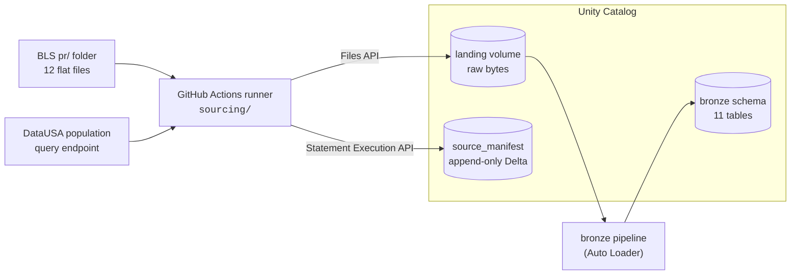
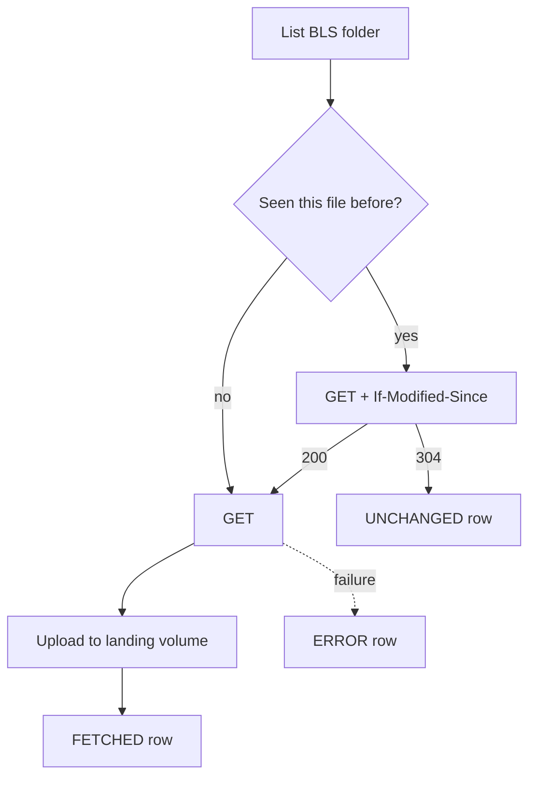

<div align="center">

# Rearc Data Quest: Databricks Edition

Sourcing two public datasets onto Databricks and modelling them as a Spark
Declarative Pipeline, deployed as a Declarative Automation Bundle (DAB) on
Databricks Free Edition.

[](https://github.com/schmucas/rearc_data_quest/actions/workflows/pr.yml)
[](https://docs.databricks.com/aws/en/getting-started/free-edition)

</div>

## Built with Claude Code

This project is built in close collaboration with Claude Cowork and Claude
Code.

Claude Code sessions run on a set of custom plugins and slash commands,
published in a personal marketplace repo,
[schmucas/dotclaude](https://github.com/schmucas/dotclaude), alongside
Databricks' own officially maintained `databricks` plugin (DABs, Lakeflow
Jobs, Spark Declarative Pipelines, Unity Catalog, and more).

This repo also wires up Databricks' managed MCP server so Claude Code can
query the workspace directly, configured via a project-level `.mcp.json`
rather than Claude's own UI, since the workspace connection is tied to this
project.

## Contents

- [The idea](#the-idea)
- [What is in here](#what-is-in-here)
- [Repo map](#repo-map)
- [Setup](#setup)
- [Design notes](#design-notes)
- [Gotchas worth knowing](#gotchas-worth-knowing)
- [Reference](#reference)

## The idea

Databricks Free Edition restricts outbound internet access from serverless
compute to a small allowlist of trusted domains. Neither BLS nor DataUSA is on
it, so a notebook calling either fails at DNS resolution, not the HTTP layer.
That constraint shapes the whole design: ingestion has to run somewhere that
can reach the network, and everything from there in has to run on Databricks,
deployed as code.

The answer: a fetcher that lives outside Databricks entirely (a GitHub Actions
runner, `sourcing/`), pushing raw bytes and a record of what it did into Unity
Catalog. A separate Lakeflow Declarative Pipeline, deployed via a Databricks
Asset Bundle, turns those landed files into typed Delta tables. The two sides
are decoupled on purpose: sourcing triggers nothing downstream, and bronze
checks for new files on its own rather than being told about them.



On a paid workspace this constraint would not exist: serverless has full
outbound access unless a restricted network policy is applied, and the fetcher
would run as a notebook task with no other change.

## What is in here

**Sources.**

| | BLS productivity | DataUSA population |
|---|---|---|
| Endpoint | [`download.bls.gov/pub/time.series/pr/`](https://download.bls.gov/pub/time.series/pr/) | `honolulu-api.datausa.io` tesseract query |
| Shape | 12 tab-delimited files in a folder | one JSON document per call |
| Update style | files rewritten in place under stable names | full result set returned every call |
| Access control | `403` without a contact-bearing `User-Agent` ([policy](https://www.bls.gov/bls/pss.htm)) | none |
| Change detection | conditional `GET` (`If-Modified-Since`) | `sha256` of the response body |

Filenames are never hardcoded. Every run re-parses the directory listing, so a
file BLS adds or removes is handled without a code change.

**The landing volume**, one independent copy per environment:
`/Volumes/rearc_ingest/<env>/landing/<source>/<dataset>/<filename>__<ingest_ts>`.

```
/Volumes/rearc_ingest/<env>/landing/
├── bls_pr/
│   ├── pr.data.1.AllData/
│   │   ├── pr.data.1.AllData__20260909T163000Z
│   │   └── pr.data.1.AllData__20261105T090200Z
│   ├── pr.series/
│   │   └── pr.series__20260909T163000Z
│   └── …one directory per file in the BLS folder
└── datausa_population/
    └── population/
        └── population.json__20260909T163000Z
```

**The manifest**, `rearc_ingest.<env>.source_manifest`: append-only Delta, one
row per `(source, dataset, ingest_ts)`, written per item on every run,
including unchanged ones.

| Column | Type | |
|---|---|---|
| `source` | STRING | `bls_pr` / `datausa_population` |
| `dataset` | STRING | original filename, or `population` |
| `ingest_ts` | STRING | run stamp, matches the landed filename suffix |
| `status` | STRING | `FETCHED` / `UNCHANGED` / `ERROR` |
| `http_status` | INT | response code, null on a request-level failure |
| `content_sha256` | STRING | hash of the body |
| `last_modified` | STRING | raw header, replayed verbatim as `If-Modified-Since` |
| `bytes` | BIGINT | size landed |
| `source_url` | STRING | exact URL fetched |
| `landing_path` | STRING | where it went, null unless `FETCHED` |
| `run_id` | STRING | GitHub Actions run id, or `local` |
| `fetched_at` | TIMESTAMP | |
| `error_message` | STRING | populated only on `ERROR` |

Each run reads the most recent `FETCHED` row per dataset to build its
conditional headers and hash comparisons. A failed directory listing is
recorded under the sentinel dataset `_directory_listing` rather than failing
silently.

**Environments.** Three environments, one workspace.

| Catalog | Schemas | Holds |
|---|---|---|
| `rearc_ingest` | `dev`, `stage`, `prod` | `landing` volume + `source_manifest`, one independent set per environment |
| `rearc_dev` / `rearc_stage` / `rearc_prod` | processing schemas | targets for the declarative pipelines |

**Bronze layer**, `resources/dp_bronze_ingestion.yml` + `src/bronze/`: one
Delta table per BLS file, one for DataUSA population, all raw. No filtering,
casting, or validation: every column lands as `STRING`, and every table
carries `_ingested_at` and `_source_file` for provenance. Trimming and typing
are silver's job.

It runs as its own pipeline, separate from silver + gold
(`resources/dp_silver_gold.yml`, currently scaffolded with no transformation
logic yet). Nothing wires the two together: bronze checks the landing volume
on every run and does nothing when there is nothing new, the same way
sourcing triggers nothing downstream.

## Repo map

```
databricks.yml            bundle definition: env + catalog_prefix, 3 targets
resources/                one file per job or pipeline
sourcing/                 the fetcher, runs on a GitHub runner, not on Databricks
  bls.py                  listing parser + conditional GET
  datausa.py              query endpoint + hash comparison
  landing.py              path construction + Files API upload
  manifest.py             Statement Execution API reads/writes
  config.py               env, catalog_prefix, warehouse resolution
src/bronze/               raw landing tables, one per BLS file + DataUSA
src/setup/                catalogs, schemas, volumes, manifest DDL
src/utils/                importable helpers, unit tested
tests/                    bundle guardrails + sourcing unit tests (no Spark)
.github/workflows/        pr, deploy-dev, deploy-stage, deploy-prod, sourcing
```

The fetcher lives outside `src/` on purpose: nothing in `sourcing/` ever runs
on Databricks compute, and nothing it imports is available there.

## Setup

One-time, per workspace:

```bash
databricks auth login --host <workspace-url>
databricks bundle run setup_job --target dev
```

Per code change:

```bash
databricks bundle deploy --target dev
databricks bundle run declarative_bronze_ingestion_job --target dev
```

Fetching new source data (needs `BLS_CONTACT_EMAIL` set, and `setup_job` to
have already created the target environment's ingest schema):

```bash
uv run python -m sourcing --env dev
```

Everything above also happens automatically, on a trigger rather than by hand:

| Trigger | Workflow | Effect |
|---|---|---|
| PR to `main` | `pr.yml` | ruff, `bundle validate`, pytest, summary report |
| Merge to `main` | `deploy-dev.yml` | deploy to `dev` |
| Tag `v*-rc*` / dispatch | `deploy-stage.yml` | deploy to `stage` |
| Tag `v*` / dispatch | `deploy-prod.yml` | gated deploy to `prod` |
| Dispatch | `sourcing.yml` | fetch sources into the selected environment |

Trunk-based: a single `main` plus short-lived feature branches. Deploy targets
are bundle targets, not git branches.

## Design notes

**Neither source is append-only:** both restate history, so landing is
immutable and every run that sees new bytes writes a new path rather than
overwriting one.

**Landing is one directory per dataset, not per source.** The 12 BLS files
have 12 different schemas, so each becomes its own table and needs its own
stream. File-first gives every stream a clean, contiguous prefix instead of a
mid-path wildcard.

**The dataset name is the original filename, verbatim.** No normalised key,
so an unknown new file lands correctly with no code change.

**`ingest_ts` is a timestamp, not a date, computed once per run.** Auto
Loader keys its checkpoint on file *path* and will not re-read a path it has
already seen. Since both sources rewrite content under stable names, every
release must land at a path that has never existed. A date would let two
changes on the same day collide and silently lose the second.

**Each environment fetches its own copy** rather than promoting one between
them. That buys cleaner isolation, at the cost of more traffic to the source
and the possibility that two environments hold snapshots taken at different
moments.

**Per item, always download, then upload, then write the manifest row, never
the reverse.**



In that order, every failure degrades to the same bytes landing twice under
two timestamps, which a downstream upsert collapses harmlessly. Reversed, one
failed upload would mean that file is never ingested again and nothing
reports it.

Rows are written per item, not batched, so a crash mid-run leaves resumable
state. One item's failure never aborts the run: the rest still land, and the
process exits non-zero at the end if anything errored. A failed item retries
on the next run by itself, because its stored `last_modified` was never
advanced. There is no rollback and no compensation logic: landing is
immutable, so recovery is a re-run, and an immediate re-run is a no-op that
lands nothing and writes 13 `UNCHANGED` rows.

**Bronze is a separate pipeline from silver and gold**, so either can be
redeployed and re-run independently, the same way sourcing and bronze are
independent.

**DataUSA lands as one VARIANT column**, not a structured schema. The whole
response is preserved as is via Auto Loader's `singleVariantColumn`, so there
is no `_rescued_data` column on that table: nothing is parsed into fields for
anything to be extra against.

**Every bronze table sets `cluster_by_auto=True`.** Databricks picks
clustering keys from observed query patterns rather than a fixed declaration.

## Gotchas worth knowing

- **Delta rejects spaces in column names outright**, regardless of table
  content. BLS pads `series_id` with literal trailing spaces inside the
  header line itself (17 characters fixed width), which fails table creation
  immediately unless `delta.columnMapping.mode = 'name'` is set. This
  surfaced as a real deploy failure, not a hypothetical.
- **BLS returns `403` without a contact-bearing `User-Agent`**, including on
  the directory listing request itself.
- **Free Edition serverless cannot reach either source.** A notebook-based
  fetcher fails at DNS resolution, not the HTTP layer, so the real cause does
  not show up in the error.
- **Auto Loader will not re-read a file path it has already processed.**
  Since BLS and DataUSA both rewrite content under stable filenames, the
  landing path needs a fresh timestamp on every run, or a same-day content
  change is silently lost.

## Reference

- [Spark Declarative Pipelines](https://docs.databricks.com/aws/en/dlt/)
- [Databricks Asset Bundles](https://docs.databricks.com/aws/en/dev-tools/bundles/)
- [Unity Catalog volumes](https://docs.databricks.com/aws/en/volumes/)
- [Auto Loader options](https://docs.databricks.com/aws/en/ingestion/cloud-object-storage/auto-loader/options)
- [Delta column mapping](https://docs.databricks.com/aws/en/delta/column-mapping)
- [VARIANT type](https://docs.databricks.com/aws/en/semi-structured/variant)
- [Databricks Free Edition](https://docs.databricks.com/aws/en/getting-started/free-edition)
- [BLS contact-email policy](https://www.bls.gov/bls/pss.htm)
