<div align="center">

# Rearc Data Quest on Databricks

Sourcing two public datasets onto Databricks, modelling them through a
bronze, silver, and gold medallion pipeline, and analyzing BLS Major Sector Productivity and Costs through an AI/BI dashboard, all deployed as a Declarative
Automation Bundle (DAB) on Databricks Free Edition.


[](https://www.databricks.com)
[](https://www.python.org)
[](https://spark.apache.org/docs/latest/api/python/)
[](https://delta.io)
[](https://claude.com/claude-code)

</div>

## Built with Claude Code

This project is built in close collaboration with Claude Cowork and Claude
Code.

Claude Code sessions run on a set of custom plugins and slash commands,
published in a personal marketplace repo,
[schmucas/dotclaude](https://github.com/schmucas/dotclaude), alongside
Databricks' own officially maintained `databricks` plugin (DABs, Lakeflow
Jobs, Spark Declarative Pipelines, Unity Catalog, and more).

This repo also wires up Databricks' managed MCP server so Claude Code can
query the workspace directly, configured via a project-level `.mcp.json`
rather than Claude's own UI, since the workspace connection is tied to this
project.

[PROCESS.md](PROCESS.md) covers how that worked in practice: the stage-by-stage
workflow, how AI output was validated and where it had to be corrected, where it
was not good enough and the work was taken over by hand, how databricks DABs helped speed up the manual edits on the UI by updating the code with the latest hand edited UI version, and what worked well and what I would do differently next time.

## Contents

- [The architecture](#the-architecture)
- [The data](#the-data)
- [The medallion layers](#the-medallion-layers)
- [CI/CD and environments](#cicd-and-environments)
- [How it looks on Databricks](#how-it-looks-on-databricks)
- [Repo map](#repo-map)
- [Design decisions and gotchas](#design-decisions-and-gotchas)
- [Trade-offs](#trade-offs)
- [Reference](#reference)

## The architecture

### The constraint that shapes everything

**Databricks Free Edition blocks outbound internet** from serverless compute to
all but a small allowlist of trusted domains. Neither BLS nor DataUSA is on it,
so a notebook calling either **fails at DNS resolution** rather than at the HTTP
layer — the error never names the real cause.

Three consequences, and the whole design follows from them:

- **Ingestion runs where the network is** — a GitHub Actions runner, not a
  notebook.
- **Everything downstream runs on Databricks**, deployed as code.
- **Unity Catalog is the boundary.** Raw bytes and an audit record cross into it;
  nothing else does.

<div align="center">
  <picture>
    <source media="(prefers-color-scheme: dark)" srcset="https://cdn.simpleicons.org/github/c9d1d9">
    
  </picture>
  &nbsp;&nbsp;&nbsp;&nbsp;<b>&rarr;</b>&nbsp;&nbsp;&nbsp;&nbsp;
  
</div>

```mermaid
flowchart LR
  subgraph GH["`**GitHub**`"]
    direction TB
    BLS["`**BLS**
    pr/ folder, 12 flat files`"]:::source
    API["`**DataUSA**
    population query endpoint`"]:::source
    GHA["`**Job 1: source and land**
    Actions runner, sourcing/`"]:::job
    BLS -->|"conditional GET"| GHA
    API -->|"sha256 of the body"| GHA
  end

  subgraph DBX["`**Databricks**`"]
    direction LR
    subgraph LAND["`**Landing**`"]
      direction TB
      VOL[("`**landing volume**
      raw bytes`")]:::storage
      MAN[("`**source_manifest**
      append-only Delta`")]:::storage
    end
    subgraph BRONZE["`**Bronze** · DP 2`"]
      BZ["`**11 tables**
      raw as landed
      Auto Loader + audit columns`"]:::bronze
    end
    subgraph J3["`**DP 3: silver and gold**`"]
      direction LR
      subgraph SILVER["`**Silver**`"]
        SV["`**10 tables**
        typed, deduplicated, CDC`"]:::silver
      end
      subgraph GOLD["`**Gold**`"]
        GD["`**3 materialized views**
        joins and aggregates`"]:::gold
      end
      SV --> GD
    end
    NOTE["`Unity Catalog: one independent copy of everything above
    per target (dev / stage / prod)`"]:::note
  end

  GHA -->|"Files API"| VOL
  GHA -->|"Statement Execution API"| MAN
  VOL -.->|"checks the volume<br/>on its own schedule"| BZ
  BZ -.->|"checks bronze tables<br/>on its own schedule"| SV

  classDef source fill:#6b7280,stroke:#374151,stroke-width:2px,color:#ffffff
  classDef job fill:#2088ff,stroke:#0b5fcc,stroke-width:2px,color:#ffffff
  classDef bronze fill:#cd7f32,stroke:#8b4513,stroke-width:2px,color:#1a1a1a
  classDef silver fill:#c0c0c0,stroke:#5b5b5b,stroke-width:2px,color:#1a1a1a
  classDef gold fill:#ffd700,stroke:#b8860b,stroke-width:2px,color:#1a1a1a
  classDef storage fill:#38bdf8,stroke:#0284c7,stroke-width:2px,color:#ffffff
  classDef note fill:#fdeee9,stroke:#fdeee9,stroke-width:0px,color:#8f1d0c

  style GH fill:#f2f4f7,stroke:#57606a,stroke-width:3px,color:#1f2328
  style DBX fill:#fdeee9,stroke:#ff3621,stroke-width:3px,color:#8f1d0c
  style LAND fill:#ffffff,stroke:#0284c7,stroke-width:2px,color:#075985
  style BRONZE fill:#ffffff,stroke:#cd7f32,stroke-width:2px,color:#7c4a1e
  style J3 fill:#fbfbfb,stroke:#9aa0a6,stroke-width:2px,color:#3c4043
  style SILVER fill:#ffffff,stroke:#8a8a8a,stroke-width:2px,color:#4a4a4a
  style GOLD fill:#ffffff,stroke:#b8860b,stroke-width:2px,color:#8a6508

  linkStyle default stroke:#4b5563,stroke-width:3px
```

### Three stages, deliberately decoupled

| # | Stage | Runs on | Triggered by |
|---|---|---|---|
| **1** | Source and land | GitHub Actions runner | own cron, 8x a year *(paused)* |
| **2** | Bronze | Lakeflow Declarative Pipeline | own cron, 8x a year *(paused)* |
| **3** | Silver and gold | Lakeflow Declarative Pipeline | own cron, 8x a year *(paused)* |

The Databricks schedules fire on the **7th of eight months a year**, matching
BLS's publication rhythm — Productivity and Costs is released preliminary and
then revised for each quarter. They ship **paused**, so unpausing is a
deliberate per-environment act rather than something a deploy does for you.
Every stage can also be run by hand at any time.

Sourcing's cron mirrors this from the GitHub Actions side: one trigger an hour
ahead of stage's bronze run, one an hour ahead of prod's, so landing data
exists before bronze reads it. GitHub Actions has no per-schedule pause flag
like `pause_status`. Instead the fetch job carries a condition that no-ops on
a scheduled run, so the trigger sits in the workflow file doing nothing until
that condition is removed.

**Nothing triggers anything else.**

- **Sourcing** triggers nothing downstream.
- **Bronze** checks the landing volume for new files on its own schedule
- **Silver and gold** checks bronze's tables on its own schedule, optimized for cost and downstream latency requirements

Two things that buys: each stage's **cadence can be tuned to what it actually
needs** — silver and gold slower or equal to ingestion leaving flexibility for
cost and downstream latency requirements. 

---

### Environment Separation - dev, stage, prod

Everything is **replicated across `dev`, `stage` and `prod`** — separate sourcing,
catalogs, separate landing volume and manifest, separate pipelines, jobs and
dashboard. It is **one Databricks Asset Bundle with three targets**: the same
commit deploys to any of them, and only `env` and `catalog_prefix` change.

Deployment is **GitHub Actions driving DABs** — PR checks, merge to `main`
deploys `dev`, a release-candidate tag deploys `stage`, a release tag deploys
`prod` behind an approval gate.

> Detail: **[CI/CD and environments](#cicd-and-environments)** ·
> **[what it looks like deployed](#three-environments-one-workspace)**

---

### 1 · The fetcher, outside Databricks

[`sourcing/`](sourcing/README.md) is a small Python package that runs on a
GitHub Actions runner.

It keeps a **manifest**: a Delta table recording what the fetcher did. One row
for every file it looked at, every time it ran — downloaded, skipped because
nothing had changed, or failed, with the size, the hash and where it landed.
Nothing is ever overwritten, so the table is both the fetcher's **memory** (what
did I see last time?) and a complete, queryable **audit trail** (what happened,
when, and to which file?).

Per run the fetcher:

1. **Reads the manifest** for the last successful fetch of each dataset.
2. **Parses the BLS directory listing** — filenames are never hardcoded, so a
   file BLS adds or removes needs no code change.
3. **Asks only for what changed** — a conditional `GET` for BLS, a body hash for
   DataUSA, which has no cache validators.
4. **Lands changed bytes** on the volume under a fresh timestamped path.
5. **Appends one manifest row per item**, whether it landed, was unchanged, or
   failed.

The whole run finishes in **under a minute**. When nothing has changed, none of
the twelve BLS files cross the wire at all — the server answers `304` and the
body is never sent. The population document is different: with no validators to
condition on, it has to be downloaded before it can be hashed. It is a couple of
KB against BLS's 4.9 MB, so what matters is that **neither source lands a new
file, and both still get a manifest row recording that the check happened**.

**The ordering is the failure design: download → upload → write the row, never
the reverse.**

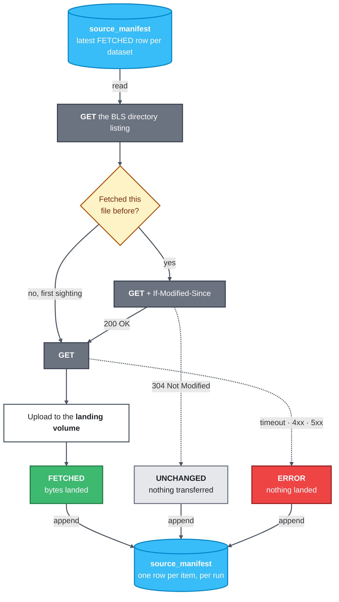

**The manifest is both ends of the loop**: the run opens by reading the last
successful fetch per dataset to build its conditional headers, and closes by
appending one row per item — landed, unchanged or failed alike.

In that order every failure degrades to the same bytes landing twice under two
timestamps, which the silver upsert collapses harmlessly. Reversed, a failed
upload leaves a row claiming the file is landed and it is **never fetched
again** — silent, permanent, unreported. There is no rollback: landing is
immutable, so **recovery is a re-run**, and an immediate re-run is a no-op.

> Full detail — BLS's contact-header policy, keeping load off a public
> government server, and exactly what happens when a source file is added,
> changed or removed — is in
> **[`sourcing/README.md`](sourcing/README.md)**.

---

### 2 · Everything else, on Databricks

One Databricks Asset Bundle, three targets, **no catalog name hardcoded
anywhere** — `env` and `catalog_prefix` are passed down and everything derives
from them.

| # | Layer | Object | What it does |
|---|---|---|---|
| **0** | **Landing** | UC volume + `source_manifest` | Immutable raw bytes, plus an append-only audit row per fetch attempt |
| **1** | **Bronze** | 11 streaming tables | Auto Loader, raw exactly as landed, everything `STRING`, provenance columns only |
| **2** | **Silver** | 10 tables | Typed, trimmed, deduplicated with SCD Type 1 change flows |
| **3** | **Gold** | 3 materialized views | The three analytical answers, PySpark primary with a Spark SQL alternative beside it |
| **4** | **Dashboard** | AI/BI (Lakeview) | The answers, readable without workspace access |

Bronze and silver/gold are **separate pipelines**, so either can be redeployed,
re-run or rescheduled without the other.

---

## The data

**Sources.**

| | BLS productivity | DataUSA population |
|---|---|---|
| Endpoint | [`download.bls.gov/pub/time.series/pr/`](https://download.bls.gov/pub/time.series/pr/) | `honolulu-api.datausa.io` tesseract query |
| Shape | 12 tab-delimited files in a folder | one JSON document per call |
| Update style | files rewritten in place under stable names | full result set returned every call |
| Access control | `403` without a contact-bearing `User-Agent` ([policy](https://www.bls.gov/bls/pss.htm)) | none |
| Change detection | conditional `GET` (`If-Modified-Since`) | `sha256` of the response body |

Filenames are never hardcoded. Every run re-parses the directory listing, so a
file BLS adds or removes is handled without a code change.
[`sourcing/README.md`](sourcing/README.md) covers the fetcher in detail: how it
satisfies BLS's contact-header policy, how it keeps load off a public government
server, how change detection differs between a file folder and a query endpoint,
and what happens when a source file is added, changed, or removed.

**The landing volume**, one independent copy per environment:
`/Volumes/rearc_ingest/<env>/landing/<source>/<dataset>/<filename>__<ingest_ts>`.

```
/Volumes/rearc_ingest/<env>/landing/
├── bls_pr/
│   ├── pr.data.1.AllData/
│   │   ├── pr.data.1.AllData__20260909T163000Z
│   │   └── pr.data.1.AllData__20261105T090200Z
│   ├── pr.series/
│   │   └── pr.series__20260909T163000Z
│   └── …one directory per file in the BLS folder
└── datausa_population/
    └── population/
        └── population.json__20260909T163000Z
```

**The manifest**, `rearc_ingest.<env>.source_manifest`: an append-only Delta
table recording what the fetcher did. One row for every file it looked at, every
time it ran — downloaded, skipped because nothing had changed, or failed, with
the size, the hash and where it landed. Nothing is overwritten, so it is both
the fetcher's memory of what it saw last time and a fully queryable audit trail.

> Column-by-column schema and how it is read back:
> **[`sourcing/README.md`](sourcing/README.md#the-manifest)**


## The medallion layers

**Bronze** (`resources/dp_bronze_ingestion.yml` + `src/bronze/`):
- One raw Delta table per BLS file, plus one for DataUSA population.
- No filtering/casting/validation: every column lands as `STRING`, with
  `_ingested_at` / `_source_file` for provenance. Typing is silver's job.
- Own pipeline and job (`declarative_bronze_ingestion_job`), decoupled from
  silver/gold and from sourcing.

**Silver** (`resources/dp_silver_gold.yml` + `src/silver/`):
- One typed, deduplicated table per bronze source.
- Numeric columns (`year`, `value`, `begin_year`, `end_year`, `base_year`,
  `display_level`, `sort_sequence`) cast to numeric; `selectable` to `BOOLEAN`.
- Identifier codes (`series_id`, `measure_code`, `sector_code`, etc.) stay
  `STRING`, since casting would drop leading zeros (e.g. `measure_code = "01"`).
- Dedup via SCD Type 1 CDC (`dp.create_auto_cdc_flow`, sequenced by
  `_ingested_at`), since both sources restate full history on every load.
- `pr_data_0_current` is left unmodelled: it's a strict subset of
  `pr_data_1_alldata`.

**Gold** (same pipeline + `src/gold/`), three fully qualified materialized views:
- `population_stats`: population mean/stddev, 2013-2018, using the population
  (not sample) formula, since the question asks about that exact window.
- `agg_value_per_year`: summed Q01-Q04 value per series/year, `is_best_year`
  flag, human-readable label built from `pr_series` dimension codes.
- `value_per_quarter`: same computation at quarter grain, with
  `best_year_per_quarter` flagged independently per series-and-quarter slot.
- Both per-series views join population by year generically rather than a
  series-specific view, since population applies the same way to any series.
- Each analysis is implemented in PySpark (primary, feeds the table) and
  Spark SQL (documented alternative).
- Own pipeline and job (`declarative_silver_gold_job`), decoupled from bronze.

**Dashboard** (`resources/dashboard.yml` + `dashboards/rearc_gold.lvdash.json`):
- One AI/BI (Lakeview) dashboard over gold, deployed as a bundle resource.
- Answers the quest's three questions: population mean/stddev, best year/quarter
  per series (human-readable label), and a chosen series's history vs. population.
- `dataset_catalog` / `dataset_schema` on the resource, not a literal catalog
  name in the JSON, keep it portable across dev/stage/prod.

**Maintenance** (`resources/maintenance.yml` + `src/maintenance/`):
- Runs `OPTIMIZE` across bronze/silver/gold, with `VACUUM` optional behind
  `run_vacuum` (default off).
- Not strictly required, predictive optimization already covers this on
  managed UC tables. Kept because bronze uses `cluster_by_auto=True`, giving a
  one-command way to see what a clustering change does to file layout.
- Not scheduled on any target.


## CI/CD and environments

**Environments.** Three environments on one workspace, separated at the catalog
level in Unity Catalog. They are bundle targets, not git branches: the same
commit deploys to any of them, and only `env` and `catalog_prefix` change.

| Catalog | Schemas | Holds |
|---|---|---|
| `rearc_ingest` | `dev`, `stage`, `prod` | `landing` volume + `source_manifest`, one independent set per environment |
| `rearc_dev` / `rearc_stage` / `rearc_prod` | `bronze`, `silver`, `gold` | targets for the declarative pipelines |

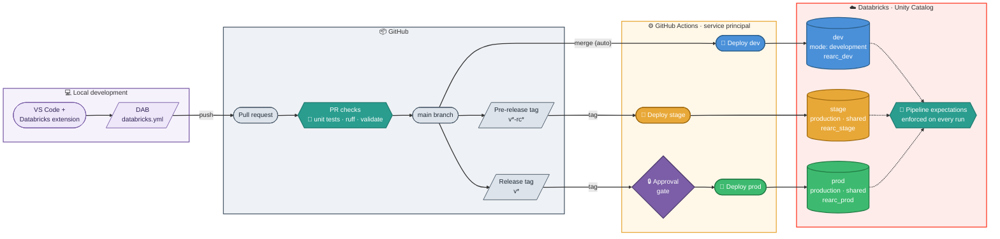

**CI/CD.** Trunk-based: a single `main` plus short-lived feature branches.
Promotion happens by tag, never by branch, and nothing reaches an environment
without passing the PR checks first.

| Trigger | Workflow | Effect |
|---|---|---|
| PR to `main` | `pr.yml` | ruff, `bundle validate --target dev`, pytest, and a rendered report on the run's Summary tab |
| Merge to `main` | `deploy-dev.yml` | auto-deploy to `dev` |
| Tag `v*-rc*` | `deploy-stage.yml` | deploy to `stage` |
| Tag `v*` | `deploy-prod.yml` | deploy to `prod`, behind an approval gate |
| Manual dispatch | `sourcing.yml` | fetch sources into the selected environment |

Both tag workflows listen on `v*`, so `deploy-prod.yml` carries a job condition
excluding anything containing `-rc`. One tag pattern therefore cannot fire both.

`dev` runs `mode: development`: every deploy is an isolated copy with prefixed
resource names and paused schedules, deployed automatically on each merge to
`main`, and equally deployable from a developer's own account locally. `stage`
and `prod` run `mode: production` with `stage_` / `prod_` name prefixes and
fixed shared root paths under `/Workspace/Shared/<target>/`, and are only ever
deployed by CI, on a tag.

Two Free Edition realities:

- **PAT, not a service principal.** No account console means no OAuth M2M;
  deploys authenticate with a PAT held as a repo secret. Same role a service
  principal would play on a paid workspace.
- **Approval gate needs a public repo.** GitHub Free enforces required
  reviewers on Environments only in public repos. In a private repo the
  `production` gate exists but the deploy proceeds unattended.
- **Schedules ship paused.** Schedules are declared per target, not in the
  resource file: `dev` stays manual, `stage`/`prod` deploy with
  `pause_status: PAUSED`. Unpausing is a deliberate, per-environment step.


## How it looks on Databricks

The quest asks for screenshots of the pipeline, the tables, and the output for
each of the three analytical questions, since reviewers may not have workspace
access. All of it below, end to end.

### Source fetch, on a GitHub runner

Manual dispatch with an environment selector, so the same workflow lands into
`dev`, `stage` or `prod`.

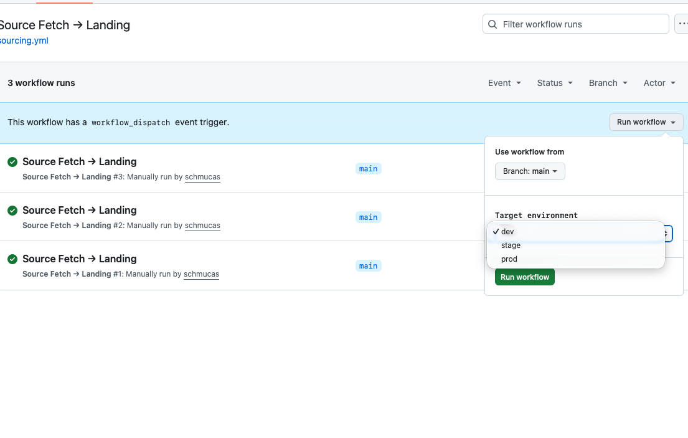

A single run: checkout, uv, dependencies, then the fetcher itself. **The whole
thing finishes in under a minute** — 40 seconds of that is the fetch step
landing all 12 BLS files plus the population document into the volume, and it is
the only part that touches the public internet.

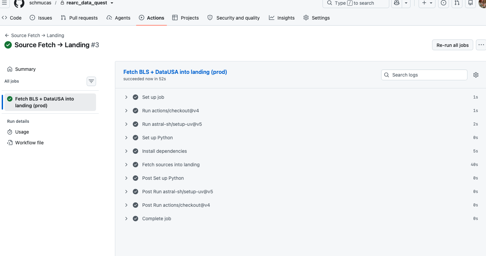

### Bronze

Eleven Auto Loader streaming tables, one per BLS file plus DataUSA population,
each reading its own landing directory. Serverless, parameterised by `env` and
`catalog_prefix`, no catalog name anywhere in the source.

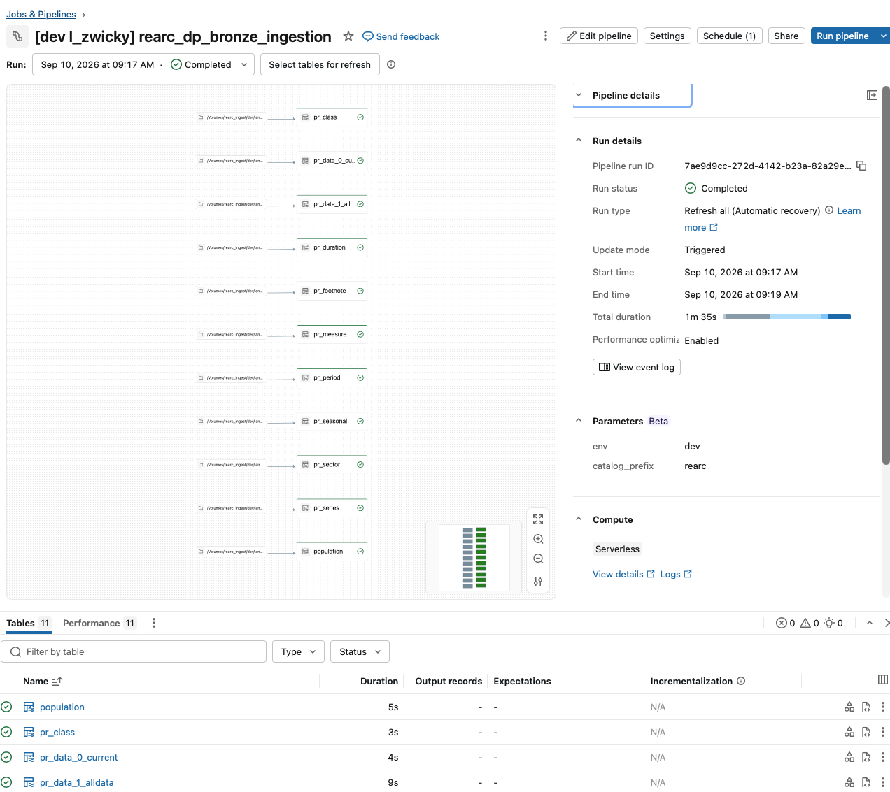

### Silver and gold

One pipeline covering both layers, resolving the dependency graph itself: each
bronze table flows through a typed intermediate view into a deduplicated silver
table, and the gold views fan in from there. Expectations are attached per
dataset and visible in the run summary.

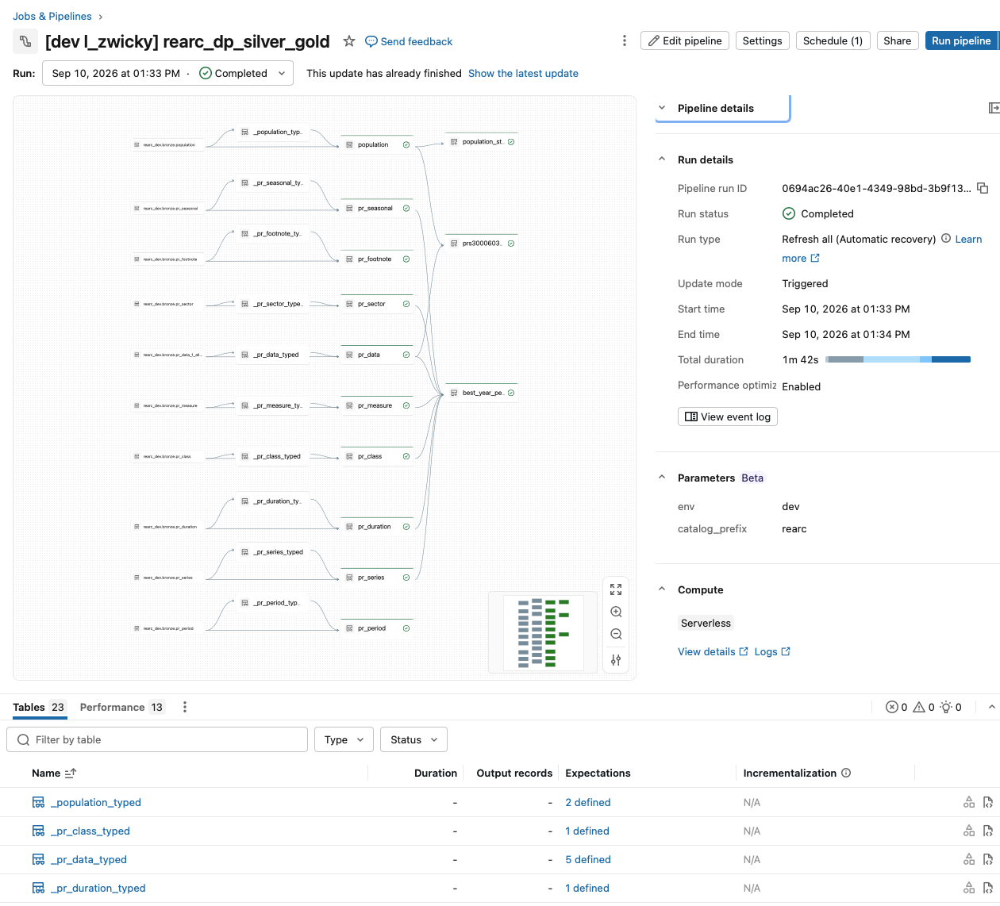

### Three environments, one workspace

Every job and pipeline exists three times over: `stage_` and `prod_` deployed by
CI, and a `[dev l_zwicky]` copy alongside them.

That prefix is `mode: development` doing its job. Databricks prepends
`[dev ${workspace.current_user.short_name}]` to every deployed resource, tags
them `dev`, pauses all schedules and triggers, and deploys into the developer's
own workspace home directory. So the prefix is **per user**: a second engineer
deploying the same bundle gets `[dev their_name]` resources in their own
directory, and the two never collide. It is Databricks' recommended shape for
team development — everyone iterates against a private copy of the full stack,
and `stage` and `prod` stay CI-only, under fixed shared paths, deployed on a tag
and never from a personal account.

Stage and prod schedules show as paused, exactly as they ship.

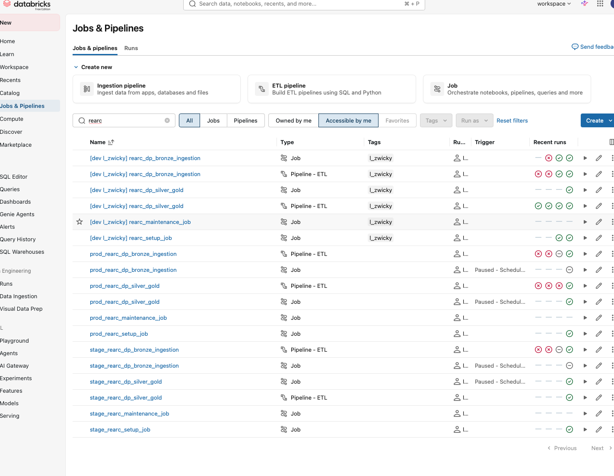

The dashboard deploys per environment the same way, as a bundle resource rather
than a hand-built asset. That matters more than it looks: a dashboard can be
reworked in the `dev` copy — datasets, widgets, layout — while `stage` and
`prod` carry on serving the last released version untouched. Changes get tried
in the workspace UI where visual work actually happens, pulled back into the
repo, and promoted on a tag. Rapid iteration on the visual layer without a
half-finished chart ever appearing in front of a consumer.

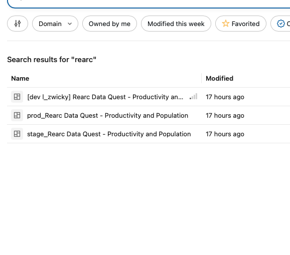

### Answering three questions

**Question 1 — mean and standard deviation of the annual US population,
2013 to 2018.** Read straight off the counters, with the year count confirming
the window is the full six years. Both conventions are shown: the headline uses
the population formula, since the question asks about exactly those six years
rather than a sample drawn from something larger, and the sample figure sits
below it for comparison.

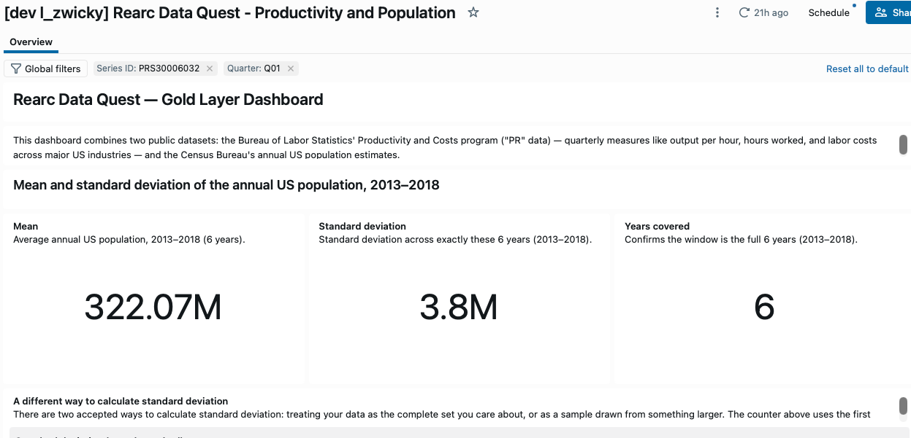

**Question 2 — the best year for every series.** 237 series, each labelled in
plain language rather than by code, with `Q05` excluded from the sum so BLS's
annual average is not counted twice. Ties resolve to the earlier year.

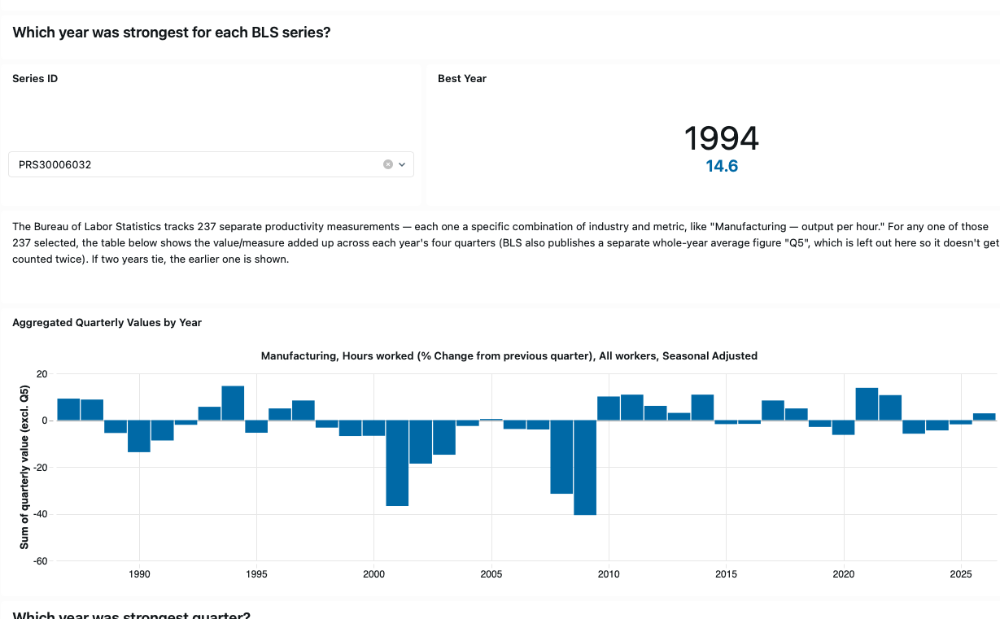

**Question 3 — a series' quarterly values against population.** Filtered to
`Q01`, value bars on the left axis and population on the right. Population only
covers part of the range, which is the left join doing its job rather than a
gap in the chart.

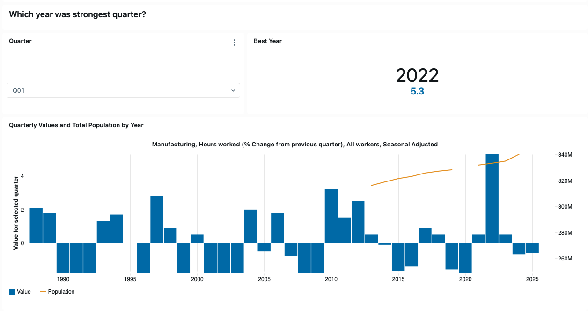

### Genie on the gold layer

Gold feeds a Genie space, so a non-technical reader can ask why the chart looks
the way it does and get an answer grounded in the data rather than guessing.

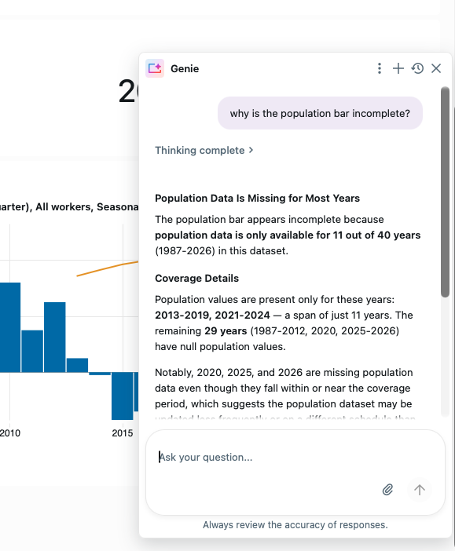

## Repo map

```
databricks.yml            bundle definition: env + catalog_prefix, 3 targets
resources/                one file per job, pipeline, or dashboard
sourcing/                 the fetcher, runs on a GitHub runner, not on Databricks
  README.md               how it works in detail: bot blocking, rate limits, idempotency
  bls.py                  listing parser + conditional GET
  datausa.py              query endpoint + hash comparison
  landing.py              path construction + Files API upload
  manifest.py             Statement Execution API reads/writes
  config.py               env, catalog_prefix, warehouse resolution
src/bronze/               raw landing tables, one per BLS file + DataUSA
src/silver/               typed, deduplicated tables, one per bronze source
src/gold/                 gold materialized views, PySpark + SQL implementations
dashboards/               Lakeview dashboard JSON, deployed via resources/dashboard.yml
src/setup/                catalogs, schemas, volumes, manifest DDL
src/maintenance/          OPTIMIZE across all schemas, optional VACUUM
src/utils/                importable helpers, unit tested
tests/                    bundle guardrails + sourcing unit tests (no Spark)
.github/workflows/        pr, deploy-dev, deploy-stage, deploy-prod, sourcing
```

The fetcher lives outside `src/` on purpose: nothing in `sourcing/` ever runs
on Databricks compute, and nothing it imports is available there.

## Design decisions and gotchas

### Why it is built this way

| Decision | Why |
|---|---|
| Landing is immutable; every changed fetch writes a new path | Neither source is append-only, both restate history |
| One landing directory per dataset, not per source | The 12 BLS files have 12 different schemas, so each needs its own table, its own stream, and a clean contiguous prefix |
| The dataset name is the original filename, verbatim | No normalised key, so a file BLS adds lands correctly with no code change |
| `ingest_ts` is a timestamp, not a date, computed once per run | Auto Loader keys its checkpoint on file *path*; a date would let two same-day changes collide and silently lose the second |
| Each environment fetches its own copy | Cleaner isolation, at the cost of 3x the source traffic and possible snapshot skew between environments |
| Bronze is a separate pipeline and job from silver and gold | Either can be redeployed, re-run or rescheduled alone. The hour offset in stage and prod is a scheduling courtesy, not a dependency |
| Bronze lands everything as `STRING` (`cloudFiles.inferColumnTypes` off) | Types get applied deliberately in silver rather than inferred. Every cast was checked against live data: `selectable` is `T`/`F`, `base_year` uses `-` as BLS's N/A sentinel |
| DataUSA lands as one VARIANT column | `singleVariantColumn` preserves the response as-is. Nothing is parsed into fields, so there is no `_rescued_data` column to populate |
| Every bronze table sets `cluster_by_auto=True` | Databricks picks clustering keys from observed query patterns instead of a fixed declaration |
| Silver dedups with Auto CDC, not a window function | `dp.create_auto_cdc_flow`, SCD Type 1, sequenced by `_ingested_at` is what actually collapses bronze's stacked snapshots after a restatement |
| Gold implements every analysis twice | PySpark is the primary that feeds the table; the Spark SQL version sits beside it as real runnable code, per the quest's ask |
| `value_per_quarter` stays separate from `agg_value_per_year` | Different grains. Merging them risks double-counting in an accidental `SUM`, or forces a discriminator column every downstream query must filter on |

### What the data does that you would not expect

| Caveat | Detail |
|---|---|
| **`Q05` is BLS's annual average, not a fifth quarter** | `PRS30006011` in 1995: quarters 2.6, 2.1, 0.9, 0.1 and `Q05` = 1.4, their mean. Gold's sum-of-quarters excludes it; including it inflates every total by ~25% and can flip which year wins |
| **`value` has no single unit** | `duration_code` decides index (2017 = 100) vs quarter-over-quarter vs year-over-year percent change; `measure_code` decides which of 23 quantities. Summed percent changes are not annual growth, and ranking across series compares incomparable units. Implemented exactly as the quest defines it; labels carry the duration text |
| **Population has no 2020** | The Census published no standard ACS 1-year estimate. Gold left-joins by year: BLS history starts in 1987, so an inner join would drop most of the answer |
| **`pr.data.0.Current` is a subset of `pr.data.1.AllData`** | 1995 onward against 1987 onward, identical schema. Landed and bronzed because it is what the source publishes, deliberately unmodelled in silver |
| **`pr.txt` is stale on the base year** | Prose says 2005 = 100, `pr.duration` says 2017 = 100. `base_year` on `pr.series` is authoritative per series |

### Things that bit us

| Gotcha | What to know |
|---|---|
| Delta rejects spaces in column names outright | BLS pads `series_id` with trailing spaces inside the header line itself (17-char fixed width). Table creation fails unless `delta.columnMapping.mode = 'name'` is set. This was a real deploy failure, not a hypothetical |
| BLS's padding is not always trailing | `series_id` pads right, `value` pads left, since BLS right-justifies numerics. Silver strips column names generically rather than assuming a direction |
| BLS returns `403` without a contact-bearing `User-Agent` | Including on the directory-listing request itself |
| Free Edition serverless cannot reach either source | Fails at DNS resolution rather than the HTTP layer, so the error never names the real cause |
| Auto Loader will not re-read a path it has processed | Both sources rewrite content under stable filenames, so the landing path needs a fresh timestamp every run |
| A column type change on an existing CDC target needs a full refresh | Delta will not merge `StringType` into `IntegerType` or `BooleanType` in place; silver's casts failed with `CANNOT_UPDATE_TABLE_SCHEMA` until refreshed. Landing is immutable, so the rebuild is deterministic |
| `variant_get` needs a bracket-quoted path for keys with spaces | DataUSA uses the literal key `"Nation ID"`, so `$["Nation ID"]`, not `$.Nation ID` |
| Dashboard resources take `dataset_catalog` / `dataset_schema` | Not `default_catalog` / `default_schema` — those do not exist in the schema (checked with `databricks bundle schema`) and silently no-op, leaving every dataset unable to resolve its catalog |
| Editing a bundle-deployed dashboard in the UI embeds a literal catalog name | Breaks portability across targets, and makes the next `bundle deploy` refuse to run (`dashboard has been modified remotely`) until the local file is re-synced or the deploy forced |
| Publishing a Lakeview dashboard does not remove edit access | It creates a separate read-styled snapshot at a `/published` URL; the editable draft is a different view |

## Trade-offs

What would change for a real client:

| Area | Here | At a client |
|---|---|---|
| **Schema drift** | `addNewColumns` plus a rescued-data column; a non-null rescue is a warn-level expectation | Alert on rescued data rather than warn, and gate promotion on it |
| **Data volume** | ~5 MB total; gold fully refreshes | Incremental gold and clustering tuned to real access patterns |
| **Cost** | Per-environment fetching means 3x the traffic to BLS, and snapshots that can differ between environments | Fetch once and promote between environments: cheaper and reproducible |
| **Access control** | Owner-only | Unity Catalog grants, with a read-only analyst role on gold and nothing below it |
| **Monitoring** | A freshness expectation off the manifest | Alerting on expectation failures and fetch errors, plus a data-quality dashboard |
| **Orchestration** | Sourcing is manual-dispatch only | Scheduled, with retries and backoff on transient source failures |

**The GitHub Actions fetcher is a workaround, not a production pattern.** It
gets around the Free Edition egress restriction, but a CI runner does not belong
on the critical path of a production ingestion. It is sufficient here, and the
source cadence makes it comfortably so: BLS publishes this data quarterly.

**Known gaps, stated rather than hidden.** The fetcher has no retry or backoff,
so one flaky connection to BLS becomes a failed run, and there is no post-upload
size verification against `content_length`.

**The sourcing workflow is unscheduled on purpose.** BLS publishes quarterly, so
a nightly cron would mean roughly 360 no-op runs a year — each writing 13
manifest rows — to catch four real changes. Leaving it on manual dispatch also
lets a reviewer trigger it and watch it run. Adding a schedule is three lines of
YAML when it becomes a running service rather than a demo.

**Accepted coupling.** Bronze lives in a declarative pipeline, so only that
pipeline can write those tables, and a full refresh of bronze is a full refresh
of everything below it. Landing is immutable and re-readable, so that costs
compute, not data.

## Reference

- [Spark Declarative Pipelines](https://docs.databricks.com/aws/en/dlt/)
- [Databricks Asset Bundles](https://docs.databricks.com/aws/en/dev-tools/bundles/)
- [AI/BI dashboards](https://docs.databricks.com/aws/en/dashboards/)
- [Unity Catalog volumes](https://docs.databricks.com/aws/en/volumes/)
- [Auto Loader options](https://docs.databricks.com/aws/en/ingestion/cloud-object-storage/auto-loader/options)
- [Delta column mapping](https://docs.databricks.com/aws/en/delta/column-mapping)
- [VARIANT type](https://docs.databricks.com/aws/en/semi-structured/variant)
- [Databricks Free Edition](https://docs.databricks.com/aws/en/getting-started/free-edition)
- [BLS contact-email policy](https://www.bls.gov/bls/pss.htm)
